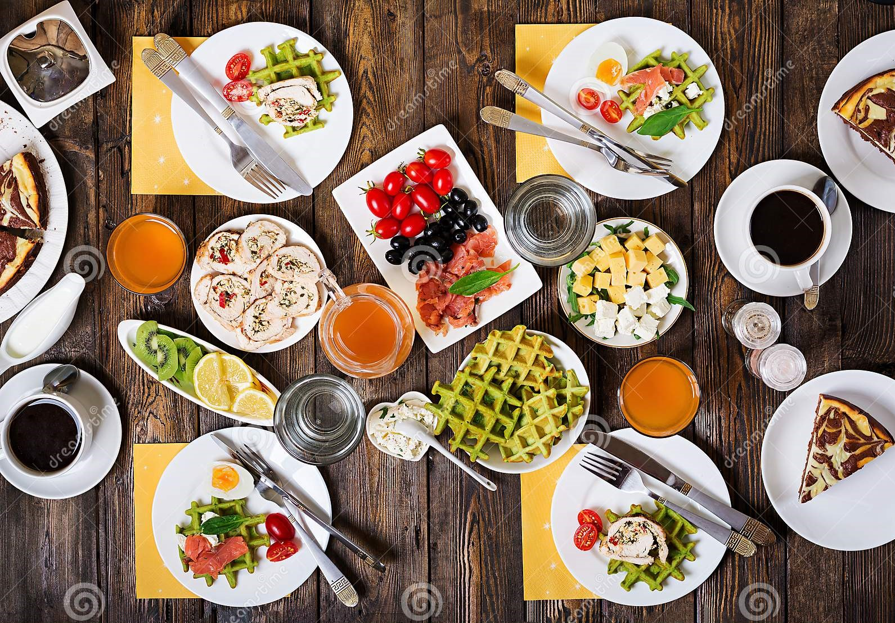
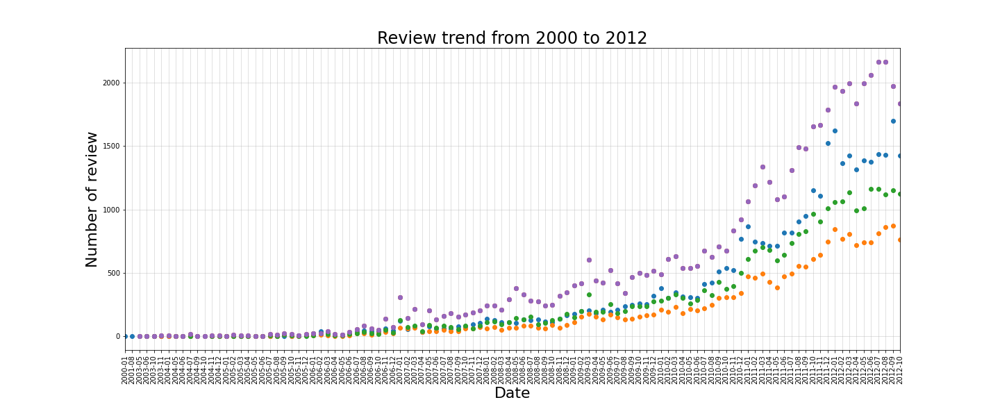
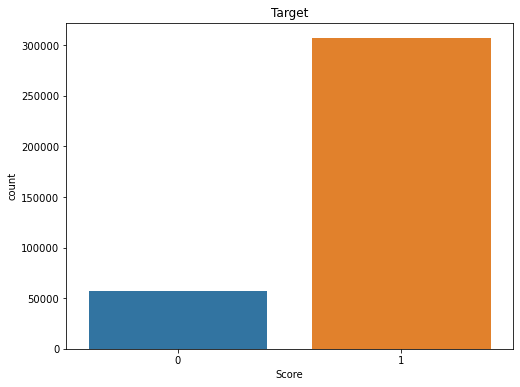
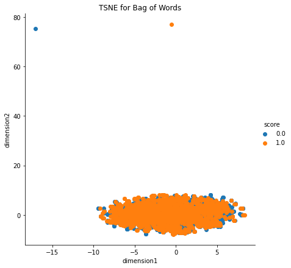
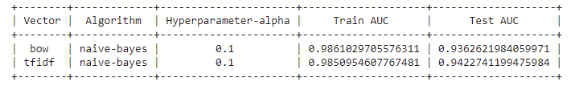
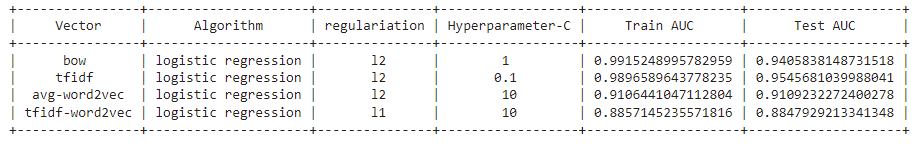
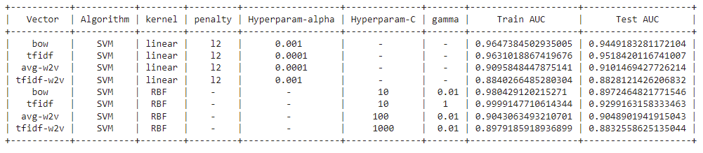
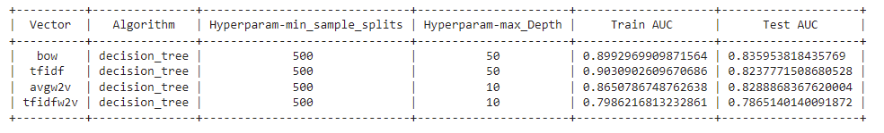
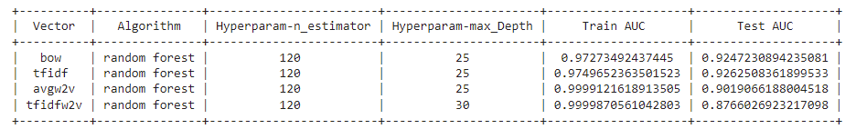
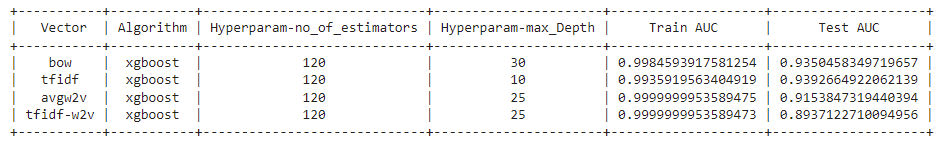

# About Dataset

Data Source: https://www.kaggle.com/snap/amazon-fine-food-reviews 


The Amazon Fine Food Reviews dataset consists of reviews of fine foods from Amazon.

* Number of reviews: 568,454
* Number of users: 256,059
* Number of products: 74,258
* Timespan: Oct 1999 - Oct 2012
* Number of Attributes/Columns in data: 10

### Attribute Information:

* Id
* ProductId - unique identifier for the product
* UserId - unqiue identifier for the user
* ProfileName
* HelpfulnessNumerator - number of users who found the review helpful
* HelpfulnessDenominator - number of users who indicated whether they found the * review helpful or not
* Score - rating between 1 and 5
* Time - timestamp for the review
* Summary - brief summary of the review
* Text - text of the review


### Objective:

**Given a review, determine whether the review is positive (rating of 4 or 5) or negative (rating of 1 or 2).**


> How to determine if a review is positive or negative?

We could use Score/Rating. A rating of 4 or 5 can be cosnidered as a positive review. A rating of 1 or 2 can be considered as negative one. A review of rating 3 is considered nuetral and such reviews are ignored from our analysis. This is an approximate and proxy way of determining the polarity (positivity/negativity) of a review.



### Analysis of review over time:
The distribution of each classes in the review is shown in the form of graph:



We converted score below 3 as negative and score above 3 as positive review. The distribution can be seen below, which is an imbalanced one



### Lets look on the some of the TSNE analysis:

1. **TSNE for Bag of Words**



2. **TSNE for TFIDF**


3. **TSNE for Average Word2Vec**


4. **TSNE for TFIDF W2V**


## Modelling

* The dataset has been run with-
  -  Naive Bayes

  

  -  Logistic Regression

  

  -  Support Vector machine

  

  -  Decision tree

  

  -  Random Forest

  

  -  Xgboost

  

* [Click here to run it live on server](https://movie-recommendation12.herokuapp.com/)

# How to run?
Clone the repository
```
https://github.com/Sagor-Saha/Amazon-Fine-Food-Reviews.git

```
Install the libraries required
```
pip install -r requirements.txt
```

run this file to generate the models

```
Final_solution.ipynb
```

Now run,
```
run app.py

```
## 🔗 Links
[](https://sagorsaha.tech/)
[](https://www.linkedin.com/in/sagor-saha-047001111/)
